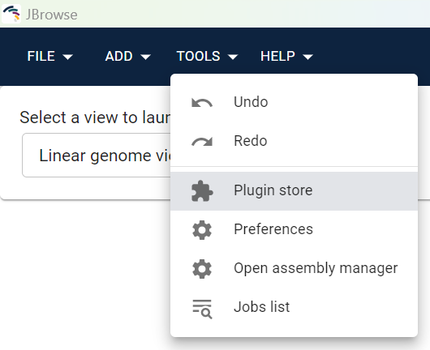
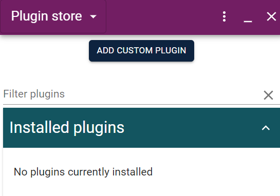
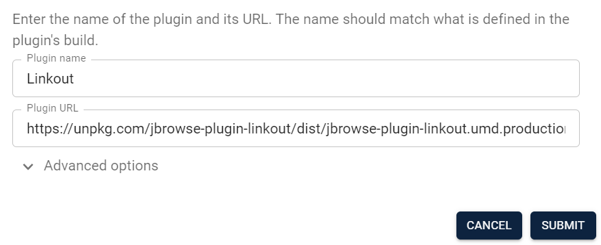
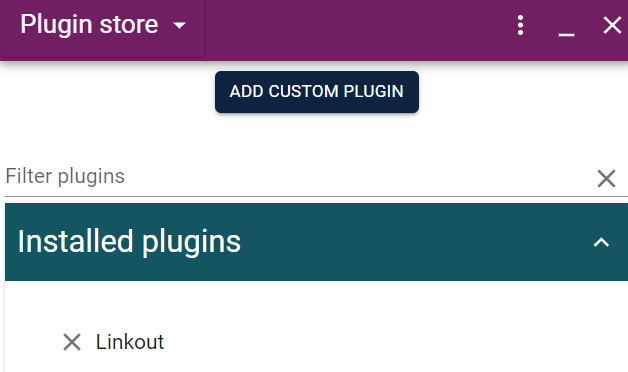
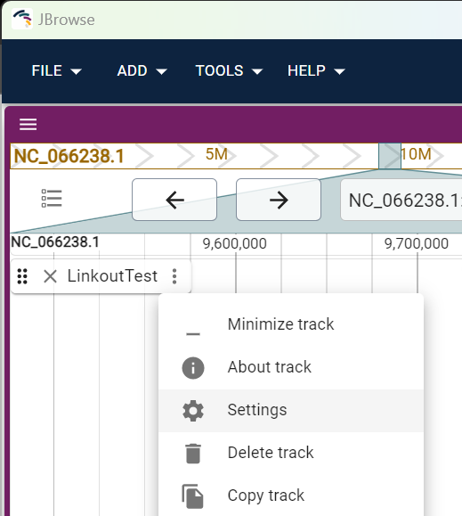
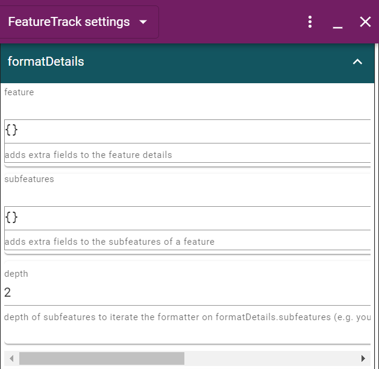
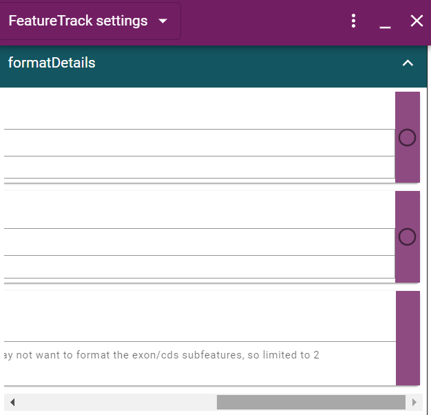
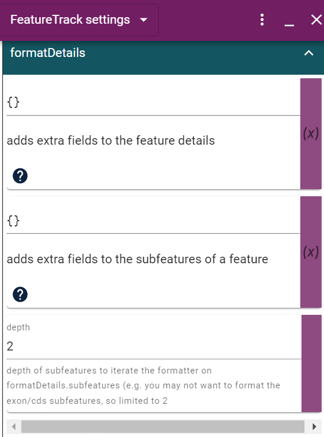
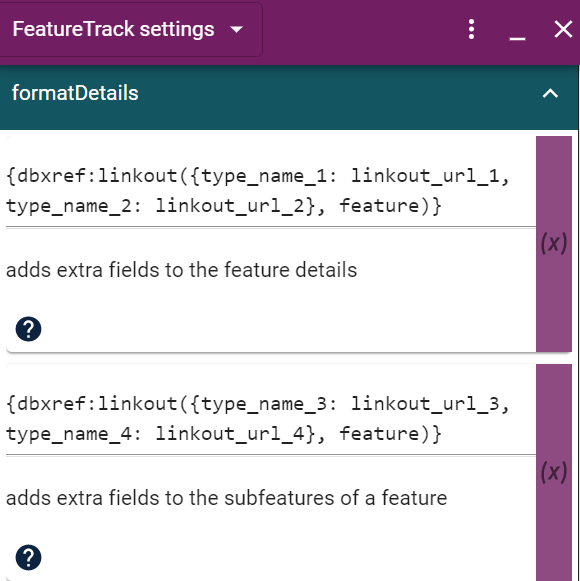
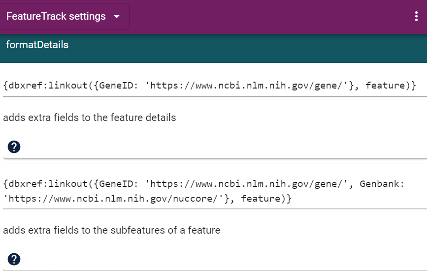

# jbrowse-plugin-linkout

> The plugin that automatically adds link outs to the national center for biotechnology information
(NCBI) feature page if a feature has NCBI ids on JBrowse.

## Usage

### Using in JBrowse 2 Desktop

**1. Click "TOOLS" &rarr; "Plugin store":**



**2. Click "ADD CUSTOM PLUGIN":**



**3. Type "Plugin name" & "Plugin URL":**
- Plugin name
```python
Linkout
```
- Plugin URL
```python
https://unpkg.com/jbrowse-plugin-linkout/dist/jbrowse-plugin-linkout.umd.production.min.js
```



**After that, you can see the Linkout in "Installed plugins"**



**4. Click on the icon with three dots on the right &rarr; "Setting" &rarr; go to "formatDetails" region in FeatureTrack settings :**





**After that, the circle will change to an "X" after clicking it.**



**5. Type "Plugin name" & "Plugin URL":**





```python
{dbxref:linkout({type_name_1: linkout_url_1}, feature)}
```

```python
{dbxref:linkout({type_name_2: linkout_url_2, type_name_3: linkout_url_3}, feature)}
```




### Using in JBrowse 2 Web

**1. Add to the "plugins" of your JBrowse Web config:**

```json
{
  "plugins": [
    {
      "name": "Linkout",
      "url": "https://unpkg.com/jbrowse-plugin-linkout/dist/jbrowse-plugin-linkout.umd.production.min.js"
    }
  ]
}
```

**2. Add to the "formatDetails" in "tracks" of your JBrowse Web config:**

```json
"tracks": [
    {
      "formatDetails": {
        "feature": "jexl: {dbxref:linkout({type_name_1: linkout_url_1}, feature)}",
        "subfeatures": "jexl: {dbxref:linkout({type_name_2: linkout_url_2, type_name_3: linkout_url_3}, feature)}"
      }
    }
  ]
```

