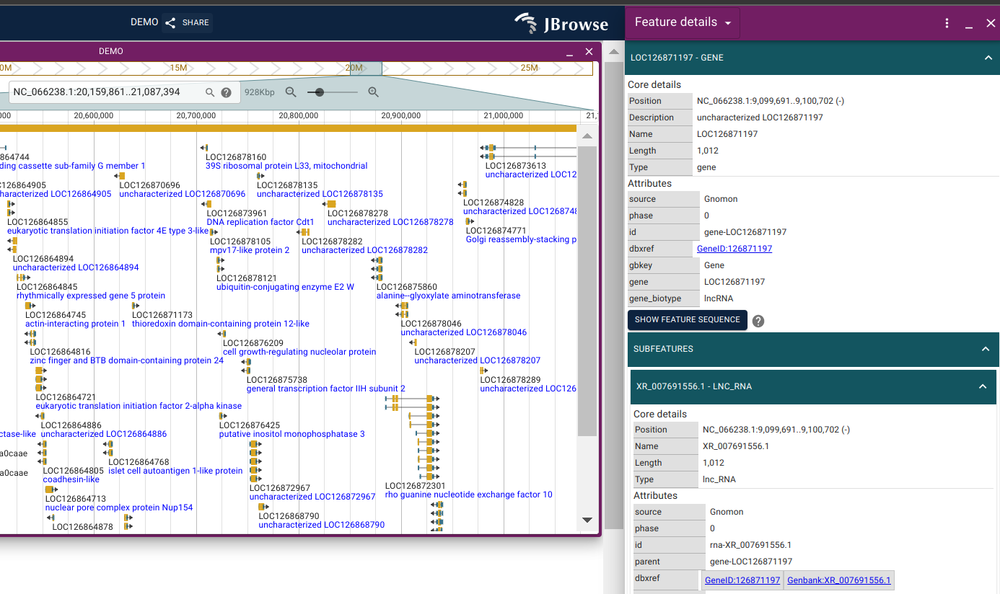

# jbrowse-plugin-linkout

Cite the code: [](https://zenodo.org/badge/latestdoi/620387272)

> The plugin allows users to define where URLs combined with id to links to obtain genetic information according to their needs. 
For example, the plugin can automatically add link outs to the national center for biotechnology information (NCBI) feature page if a feature has NCBI ids on JBrowse 2 desktop or web.

## Usage

### Using in JBrowse 2 Desktop

**1. Click `TOOLS` &rarr; `Plugin store`:**


**2. Click `ADD CUSTOM PLUGIN`:**


**3. Type `Plugin name` & `Plugin URL` &rarr; click `SUBMIT`:**


**You can copy it here:**

- Plugin name
```python
Linkout
```
- Plugin URL
```python
https://unpkg.com/jbrowse-plugin-linkout/dist/jbrowse-plugin-linkout.umd.production.min.js
```

**After that, you can see the Linkout in `Installed plugins`**


**4. Click on `the icon with three dots` on the right &rarr; click `Setting`:**


**5. Go to `formatDetails` in `FeatureTrack settings` in the block on the right:**


**6. Scroll right and you will see circles `O`:**


**7. After clicking the cycle, the circle will change to an `X`:**


**8. Type the setting of the feature or subfeatures based on your needs**

The format is as follows:

- feature
```python
{dbxref:linkout({type_name_1: linkout_url_1, type_name_2: linkout_url_2}, feature)}
```
- subfeatures
```python
{dbxref:linkout({type_name_3: linkout_url_3, type_name_4: linkout_url_4}, feature)}
```

**Like this:**


#### Congratulations! You complete it!

### For example:

> The plugin that automatically adds link outs to the national center for biotechnology information
(NCBI) feature page if a feature has NCBI ids on JBrowse.


- feature
```python
{dbxref:linkout({GeneID: 'https://www.ncbi.nlm.nih.gov/gene/'}, feature)}
```
- subfeatures
```python
{dbxref:linkout({GeneID: 'https://www.ncbi.nlm.nih.gov/gene/', Genbank: 'https://www.ncbi.nlm.nih.gov/nuccore/'}, feature)}
```

**You can click the `GeneID:126871197` or `Genbank:XR_007691556.1` in `dexref` on the right:**



### Using in JBrowse 2 Web

**1. Add to the `plugins` of your JBrowse Web config:**

```json
{
  "plugins": [
    {
      "name": "Linkout",
      "url": "https://unpkg.com/jbrowse-plugin-linkout/dist/jbrowse-plugin-linkout.umd.production.min.js"
    }
  ]
}
```

**2. Add to the `formatDetails` in `tracks` of your JBrowse Web config:**

```json
"tracks": [
    {
      "formatDetails": {
        "feature": "jexl: {dbxref:linkout({type_name_1: linkout_url_1}, feature)}",
        "subfeatures": "jexl: {dbxref:linkout({type_name_2: linkout_url_2}, feature)}"
      }
    }
  ]
```

